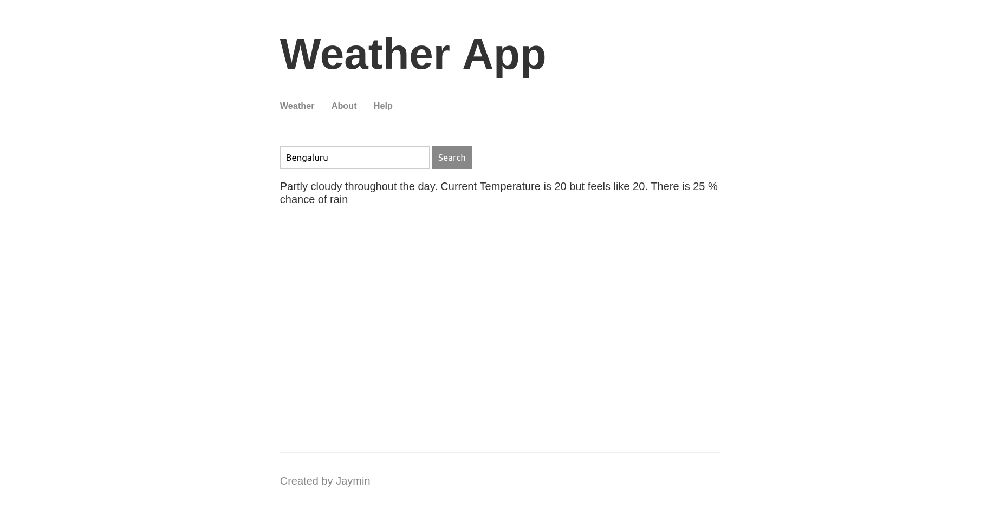

# node-weather-app

- Node Js Application that fetches current temperature based on location entered

- 

# Steps to Install

- Clone the application
- npm install
- node src/app.js
- Application will be started on local port.

- You can check demo at [Weather App](https://node-weather-app-ksmc.onrender.com/) OR (https://node-weather-app-ksmc.onrender.com/)
